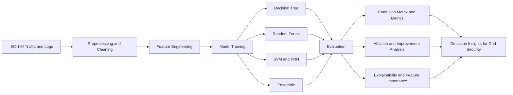
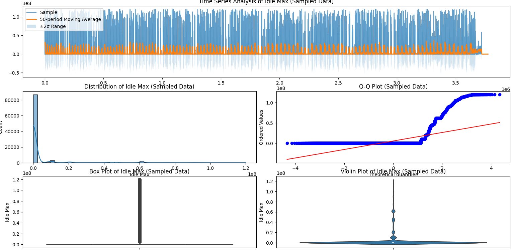
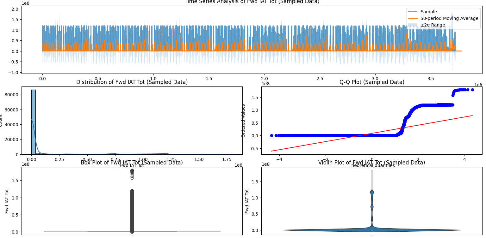
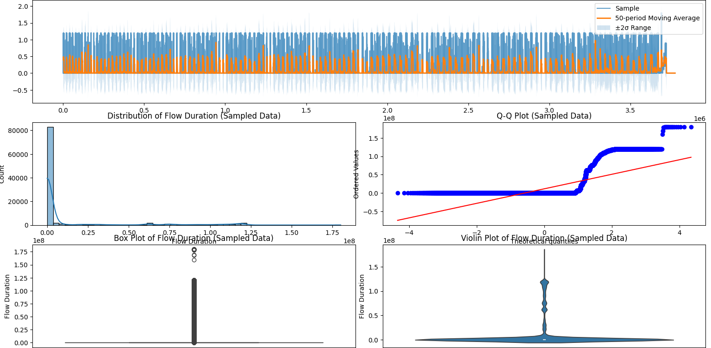
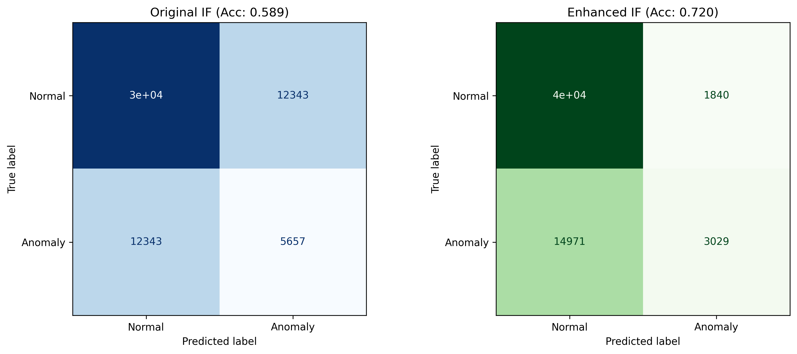
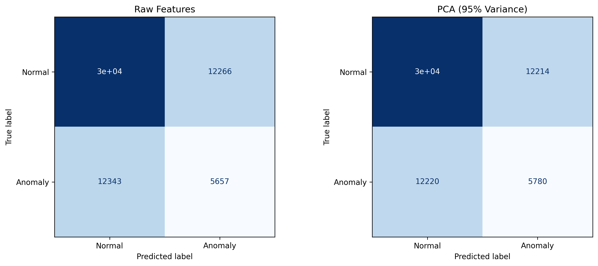
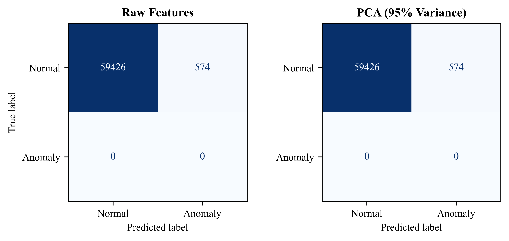

# CyberAttackonSmartGrids

Intrusion detection and analysis pipeline for IEC 60870-5-104 smart-grid traffic using feature engineering, model benchmarking, and adversarial robustness checks.

## Paper Context

- IEEE reference: https://ieeexplore.ieee.org/document/11083563

## Project Scope

This repository focuses on end-to-end cyberattack analysis for smart-grid communications:

- traffic and feature analysis from IEC-104 network captures
- supervised attack detection with multiple model families
- ensemble and ablation experiments
- explainability and robustness-oriented evaluations

## Repository Layout

The project uses the repository root as the main project location (no nested main folder).

```text
.
|- README.md
|- ids.py / ids1.py / honey*.py / security and analysis scripts
|- results/
|  |- analysis_report.txt
|  |- dataset_summary.txt
|- IEEE_Plots/
|- Graphs/
|- docs/
|  |- architecture.mmd
|  |- screenshots/
```

## Architecture



Mermaid source: [docs/architecture.mmd](docs/architecture.mmd)

## README Explanation

### Problem
Smart-grid communication protocols are vulnerable to cyberattacks that can disrupt critical infrastructure. The goal is to detect malicious traffic patterns reliably while handling large-scale and noisy data.

### Approach
- Load and analyze high-dimensional traffic data (up to 208 columns).
- Train multiple models and compare accuracy/training behavior.
- Validate with confusion matrices and classification reports.
- Run ablation studies to understand feature/model contribution.

### Data Snapshot
- Records: 3,775,534
- Features: 208
- Labels: NORMAL vs ANOMALY

Sources in this repo:
- [results/dataset_summary.txt](results/dataset_summary.txt)
- [results/analysis_report.txt](results/analysis_report.txt)
- [evaluation_report.txt](evaluation_report.txt)

## Results

### Benchmark Summary (from analysis report)

| Model | Accuracy | Notes |
| --- | --- | --- |
| Decision Tree | 91.16% (+/-0.43%) | Fast training |
| Random Forest | 91.66% (+/-0.45%) | Strong baseline |
| SVM | 76.65% (+/-0.90%) | Lower than tree models |
| KNN | 76.65% (+/-0.90%) | Similar to SVM |
| Ensemble | 91.81% | Best overall in report |

### Binary Evaluation Snapshot

From [evaluation_report.txt](evaluation_report.txt):

- Accuracy: 64.45%
- Confusion matrix:
	- TN: 2,142,826
	- FP: 670,915
	- FN: 671,176
	- TP: 290,617
- Class-wise performance:
	- NORMAL: Precision 0.76, Recall 0.76, F1 0.76
	- ANOMALY: Precision 0.30, Recall 0.30, F1 0.30

These numbers indicate good NORMAL detection with significant room to improve anomaly recall and precision under imbalance/noise.

## Screenshots

### Core Evaluation







### Ablation and Improvement







## How To Run

This repository contains multiple experiment scripts. Typical flow:

1. Prepare dataset paths in the selected script.
2. Run preprocessing and feature analysis scripts.
3. Train baseline models.
4. Run evaluation and ablation scripts.
5. Inspect generated outputs in results and plot folders.

## Current Limitations

- Some scripts are exploratory and named by iteration stage.
- Reproducibility can be improved by consolidating run entrypoints.
- Class imbalance impacts anomaly performance in some evaluations.

## Next Improvements

- Add a single orchestrated training/evaluation pipeline.
- Add fixed train/val/test split config and seed control.
- Add richer anomaly-focused metrics (PR-AUC, per-attack breakdown).
